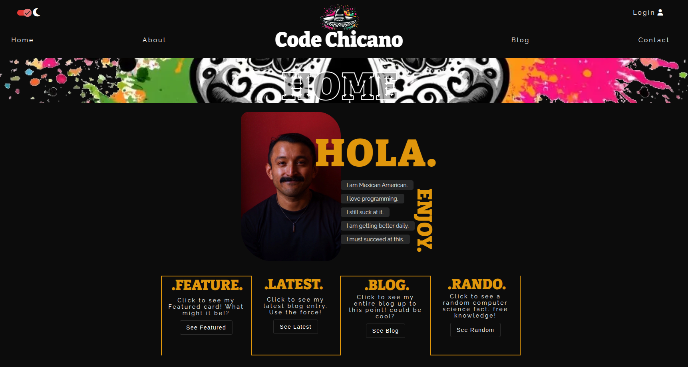
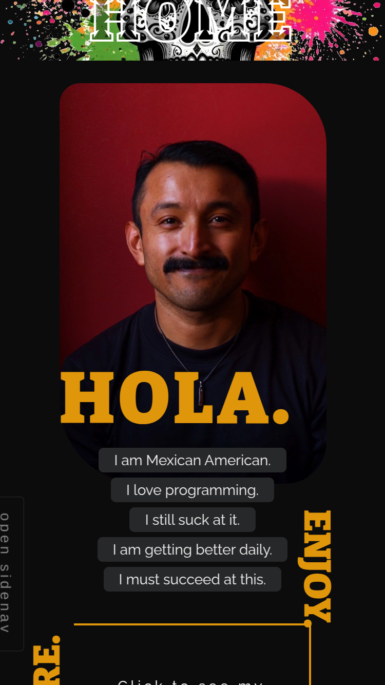

# Code Chicano

**Live Site:** [Code Chicano](https://code-chicano.netlify.app/home)  
**Repository:** [GitHub](https://github.com/dev-jLagunas/code-chicano)

Code Chicano is a full CRUD application and an online blog that shares my journey and experiences as a Mexican-American frontend developer. It is designed with a focus on clean UI/UX, responsiveness, and optimized performance. Users can explore blog posts, and authenticated users can create, edit, and delete posts using the Quill editor. This project highlights the intersection of storytelling and technology through an intuitive interface.

## Features

- **CRUD Functionality:** Full support for creating, reading, updating, and deleting blog posts.
- **Responsive Design:** Optimized for mobile, tablet, and desktop screens.
- **Light/Dark Modes:** Users can toggle between light and dark themes for a personalized viewing experience.
- **Custom AI-Generated Graphics:** Unique visual assets generated using AI.
- **Authentication:** Secure login functionality enabling personalized content management.
- **Firebase Integration:** Handles database storage and user authentication efficiently.
- **Optimized Images:** All images are served in the optimized WebP format to ensure fast load times.
- **High Lighthouse Scores:** All categories score above 90%, ensuring performance, accessibility, and SEO.
- **Powered by Angular Material:** Modern UI components with an emphasis on usability and performance.
- **Quill Editor Integration:** Rich text editing capabilities for blog post creation and updates.
- **Observables and RxJS:** Advanced state management and reactive programming patterns for a seamless user experience.

## Screenshots

### Desktop

  
  

## Recommended IDE Setup

[VSCode](https://code.visualstudio.com/) + [Volar](https://marketplace.visualstudio.com/items?itemName=Vue.volar) (and disable Vetur).

## Customize Configuration

See [Vite Configuration Reference](https://vitejs.dev/config/).

## Installation and Setup Instructions

Clone down this repository. You will need `node` and `npm` installed globally on your machine.

- **Install project dependencies:** `npm install`
- **To Start Server:** `npm run dev`
- **To Visit App:** `http://localhost:5173`

## Contributing

While this project is primarily a personal, educational project, input and suggestions are welcome. If you have feedback, please open an issue in this repository.

## License

This project is licensed under the terms of the MIT License. See the [LICENSE](LICENSE) file for details.

## Contact

**Juan Lagunas** - [GitHub](https://github.com/dev-jLagunas)

Email: dev.jlagunas@gmail.com

Feel free to reach out if you have any questions, or if you want to discuss this project. You can also [open an issue](https://github.com/dev-jLagunas/cosmic-neighborhood/issues/new) for any bugs you've found or enhancements you think would be useful.

For more of my work, check out my [GitHub profile](https://github.com/dev-jLagunas) or visit my Frontend Mentor profile for other projects I've done: [FrontendMentor](https://www.frontendmentor.io/profile/dev-jLagunas)

## Acknowledgements

- Thanks to [Angular](https://angular.io/)
- Thanks to all the contributors who have helped with this project.
- Thanks to anyone who takes the come to checkout my work.
- Thanks to my wife for giving me the opportunity to spend so much time in front of a computer.
